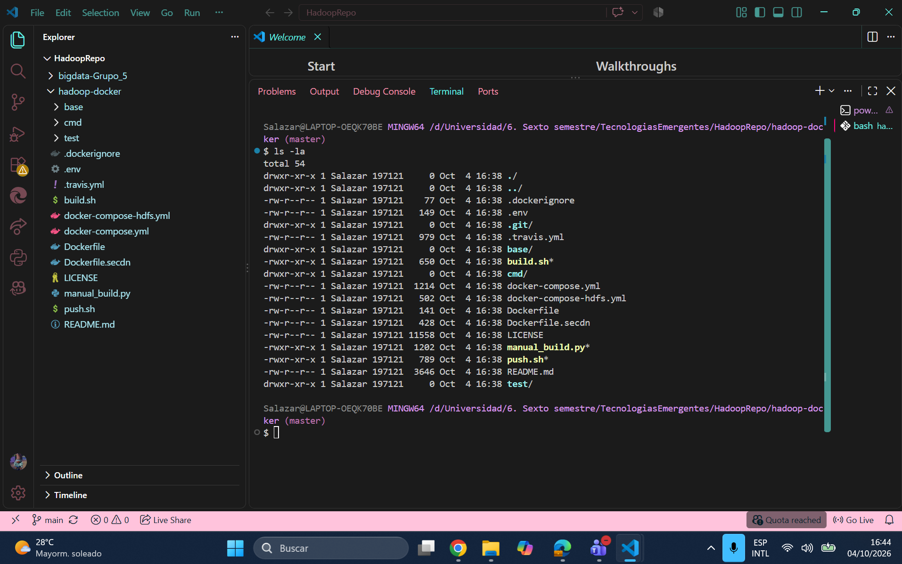
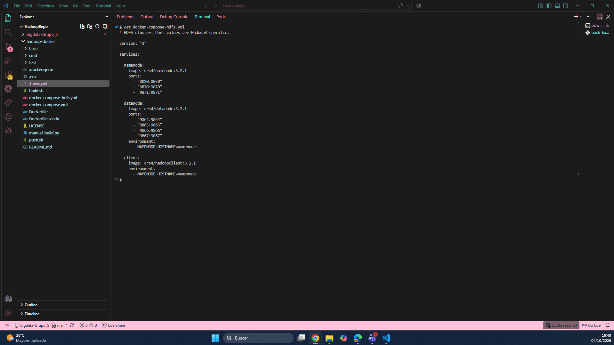
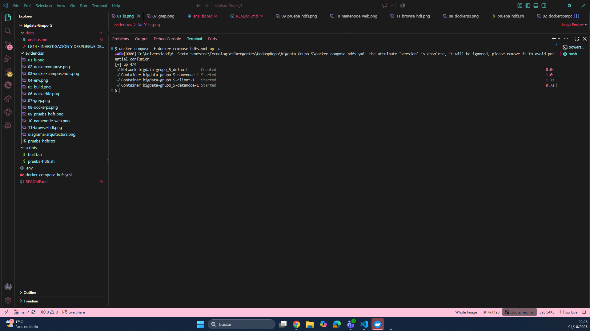
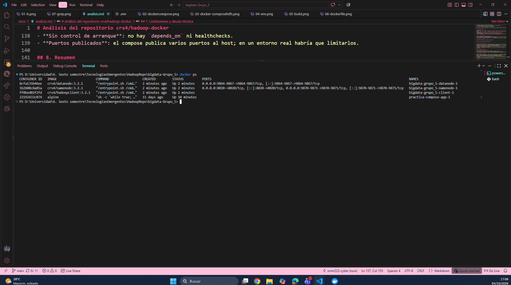
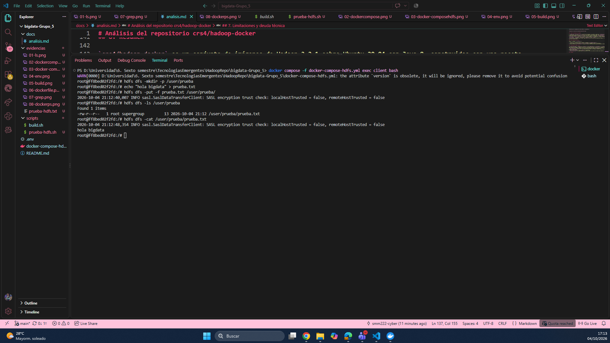
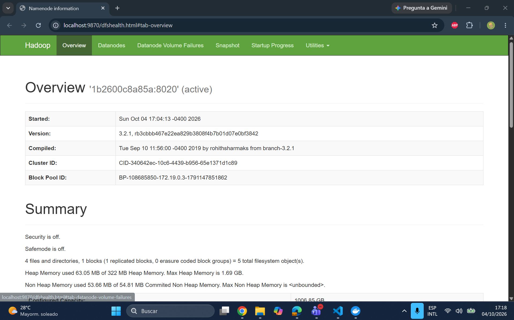
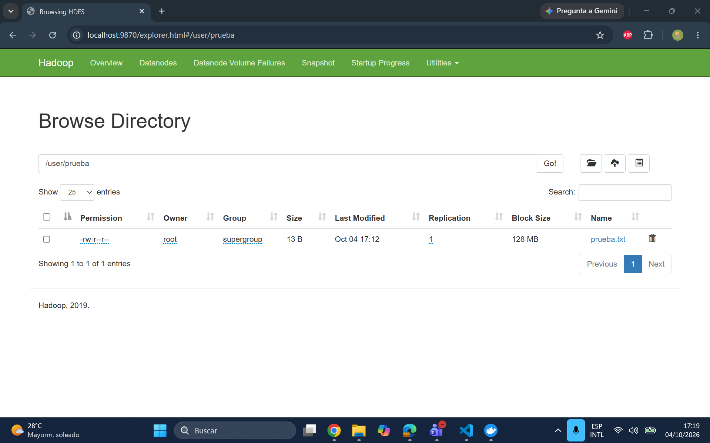

# bigdata-Grupo_5
 
## 1. Repositorio seleccionado
 
| Dato | Valor |
|---|---|
| Repositorio | hadoop-docker |
| URL | https://github.com/crs4/hadoop-docker |
| Autor / organización | CRS4 |
| Licencia | Apache-2.0 |
| Descripción | Imágenes Docker de Apache Hadoop (HDFS, YARN y MapReduce), una por servicio, con archivos Docker Compose para levantar un cluster pequeño. |
 
Elegimos este repositorio porque es de Hadoop, usa Docker y Docker Compose, tiene archivos de configuración propios y permite hacer una prueba funcional de HDFS sin necesitar demasiados recursos del equipo.
 
El análisis detallado (tecnologías, contenedores, puertos, redes, volúmenes, variables y limitaciones) está en [`docs/analisis.md`](docs/analisis.md).
 
## 2. Arquitectura
 
Desplegamos el compose de HDFS (`docker-compose-hdfs.yml`), que tiene 3 contenedores:
 
| Contenedor | Imagen | Función |
|---|---|---|
| namenode | `crs4/namenode:3.2.1` | Guarda los metadatos de HDFS: qué archivos existen y en qué bloques están |
| datanode | `crs4/datanode:3.2.1` | Guarda los bloques de datos |
| client | `crs4/hadoopclient:3.2.1` | Contenedor desde el que ejecutamos los comandos `hdfs dfs` |
 

 
Puntos importantes:
- Los tres contenedores se conectan a la red `bridge` que Docker Compose crea por defecto y se encuentran por nombre (`namenode`).
- El compose **no define volúmenes**, por lo que los datos de HDFS se pierden al ejecutar `docker compose down`.
- Todas las imágenes salen de una misma imagen base (`crs4/hadoop-base`, con Ubuntu 20.04, Java 8 y Hadoop 3.2.1), y una sola receta `Dockerfile` genera cada servicio según el argumento `cmd`.
- El repositorio también trae un compose completo con ResourceManager, NodeManager y HistoryServer (YARN y MapReduce). No lo usamos para mantener el consumo de recursos bajo.
 
## 3. Requisitos
- Docker Desktop (con Docker Compose v2) en funcionamiento.
- Git.
- Unos 4 GB de RAM libres para Docker (valor aproximado).
 
## 4. Instalación y ejecución
 
### Paso 1. Clonar el repositorio original
```bash
git clone https://github.com/crs4/hadoop-docker
cd hadoop-docker
```
 
### Paso 2. Identificar los archivos principales
```bash
ls -la
```

 
### Paso 3. Analizar el compose
```bash
cat docker-compose-hdfs.yml
```

 
Usamos una copia de este archivo en la raíz de nuestro repositorio.

Otras capturas del análisis (`.env`, `build.sh`, `Dockerfile`, búsqueda de `daemon` e imágenes descargadas) están en la carpeta [`evidencias/`](evidencias/).
 
### Paso 4. Descargar las imágenes y ejecutar
Las imágenes `crs4/namenode`, `crs4/datanode` y `crs4/hadoopclient` (versión 3.2.1) están publicadas en Docker Hub, por lo que no fue necesario construirlas. Docker Compose las descarga y levanta el cluster en segundo plano:
```bash
docker compose -f docker-compose-hdfs.yml up -d
```

### Paso 5. Verificar los contenedores
```bash
docker ps
```
Se ven los tres contenedores (namenode, datanode y client) en estado `Up`.
 

 
 
## 5. Prueba funcional (HDFS)
 
La prueba consiste en crear un directorio, cargar un archivo y consultarlo. El script está en [`scripts/prueba-hdfs.sh`](scripts/prueba-hdfs.sh).
 
```bash
docker compose -f docker-compose-hdfs.yml exec client bash
hdfs dfs -mkdir -p /user/prueba
echo "hola bigdata" > prueba.txt
hdfs dfs -put -f prueba.txt /user/prueba/
hdfs dfs -ls /user/prueba
hdfs dfs -cat /user/prueba/prueba.txt
```
 
| Acción | Comando | Resultado |
|---|---|---|
| Crear directorio | `hdfs dfs -mkdir -p /user/prueba` | Se crea sin errores |
| Cargar archivo | `hdfs dfs -put -f prueba.txt /user/prueba/` | El archivo sube a HDFS |
| Consultar archivo | `hdfs dfs -ls /user/prueba` | `Found 1 items`: `prueba.txt`, 13 bytes |
| Leer contenido | `hdfs dfs -cat /user/prueba/prueba.txt` | Muestra `hola bigdata` |
 

 
El resultado también está guardado como texto en [`evidencias/prueba-hdfs.txt`](evidencias/prueba-hdfs.txt).
 
### Verificación desde la interfaz web del NameNode
Con el cluster activo, entramos a http://localhost:9870. En la página principal se ve un nodo activo y, en *Utilities → Browse the file system*, el archivo dentro de `/user/prueba`.
 

 

 
### Observaciones
- Los mensajes `SASL encryption trust check` que aparecen al subir y leer el archivo son informativos (nivel `INFO`): indican que el cliente y el datanode no están marcados como de confianza para cifrado, algo normal en un cluster de pruebas sin seguridad.
- En el listado, el número `1` junto a los permisos es el factor de replicación: hay una sola copia del bloque porque el cluster tiene un solo datanode.
- Compose mostró la advertencia `the attribute version is obsolete`; no afecta el funcionamiento.
 
### Apagar el cluster
```bash
docker compose -f docker-compose-hdfs.yml down
```
Como no hay volúmenes, esto elimina también los datos guardados en HDFS.
 
## 6. Comparación con docker-hadoop

Comparamos con [big-data-europe/docker-hadoop](https://github.com/big-data-europe/docker-hadoop). El objetivo es ver diferencias de arquitectura, tecnología y propósito, no decidir cuál es mejor.

| Característica | docker-hadoop | Repositorio seleccionado (crs4/hadoop-docker) |
|---|---|---|
| Tecnología principal | Hadoop | Hadoop |
| Docker | Sí | Sí |
| Docker Compose | Sí | Sí |
| Número de contenedores | 5: namenode, datanode, resourcemanager, nodemanager, historyserver | 3: namenode, datanode, client (compose HDFS) |
| Almacenamiento distribuido | HDFS (NameNode + DataNode) | HDFS con 1 DataNode |
| Procesamiento distribuido | YARN y MapReduce | No en nuestro despliegue (solo HDFS). El compose completo incluye YARN y MapReduce, pero no las levantamos |
| Interfaces web | 5: NameNode 9870, DataNode 9864, ResourceManager 8088, NodeManager 8042, HistoryServer 8188 | 2: NameNode (9870, HTTPS 9871) y DataNode (9864, HTTPS 9865) |
| Persistencia | Volúmenes de Docker para datos del NameNode, DataNode e HistoryServer | Ninguna: no define volúmenes, los datos se pierden con `docker compose down` |
| Complejidad de instalación | Baja: `docker-compose up` con imágenes ya publicadas | Baja-media: `pull` y `up`; si las imágenes no están, hay que construirlas con `build.sh` |
| Documentación | README breve: arranque rápido, URLs y configuración por variables en `hadoop.env` | README breve: construcción, uso, cambio de versión y configuración propia |
| Caso de uso | Clúster HDFS/YARN de ejemplo y base para otros stacks | Imágenes Hadoop personalizables, una por servicio, para pruebas y desarrollo |

**Diferencias principales**

- Ambos son entornos de pruebas de Hadoop sobre Docker Compose. docker-hadoop levanta HDFS y YARN juntos; en nuestro despliegue de crs4/hadoop-docker solo levantamos HDFS.
- docker-hadoop está pensado para levantar un clúster ya armado, con persistencia mediante volúmenes y configuración por variables en `hadoop.env`.
- crs4/hadoop-docker se centra en cómo se **construyen** las imágenes: una receta común, una imagen por servicio, versión de Hadoop elegible (`HADOOP_VERSION`) y configuración reemplazable (`HADOOP_CUSTOM_CONF_DIR`). Por eso nos permitió elegir una parte del clúster (solo HDFS), aunque sin persistencia.
- crs4/hadoop-docker incluye un contenedor `client` dedicado para ejecutar comandos; docker-hadoop no incluye uno.
- Mantenimiento: el último commit de crs4/hadoop-docker es del 17 de diciembre de 2020, y su deuda técnica conocida son los scripts `*-daemon.sh`, obsoletos en Hadoop 3.
 
## 7. Limitaciones encontradas
- **Scripts deprecados:** `cmd/hadoop.sh` y `cmd/hdfs.sh` usan `hadoop-daemon.sh`, `yarn-daemon.sh` y `mr-jobhistory-daemon.sh`, obsoletos en Hadoop 3 aunque todavía funcionan en 3.2.x. Los servicios individuales que usamos no dependen de ellos.
- **Sin persistencia:** no hay volúmenes definidos.
- **Sin mantenimiento reciente:** el último cambio fue el 17 de Diciembre de 2020.
- **Sin control de arranque:** no hay `depends_on` ni healthchecks; el datanode puede tardar unos segundos en registrarse.
 
## 8. Estructura del repositorio
```
bigdata-Grupo_5/
├── README.md
├── docker-compose-hdfs.yml    compose usado en el despliegue
├── .env                       variables del repositorio original
├── scripts/
│   ├── build.sh               script del repositorio original (copiado para análisis, no se usó en el despliegue)
│   └── prueba-hdfs.sh         prueba funcional de HDFS
├── docs/
│   └── analisis.md            análisis detallado
└── evidencias/                capturas, resultados de las pruebas y diagrama de arquitectura
```
 
## 9. Conclusiones
- Pudimos desplegar un cluster HDFS de tres contenedores y comprobar su funcionamiento: creamos un directorio, cargamos un archivo y lo leímos.
- Entendimos que NameNode y DataNode cumplen funciones distintas: uno guarda metadatos y el otro los bloques de datos, mientras el cliente consulta a ambos.
- Una sola receta de Dockerfile con un argumento permite generar imágenes distintas para cada servicio, lo que reduce la duplicación.
- Sin volúmenes, los datos desaparecen al eliminar los contenedores, lo que muestra la importancia de la persistencia en un despliegue real.
 
## Referencias
- Repositorio analizado: https://github.com/crs4/hadoop-docker
- Repositorio de comparación: https://github.com/big-data-europe/docker-hadoop