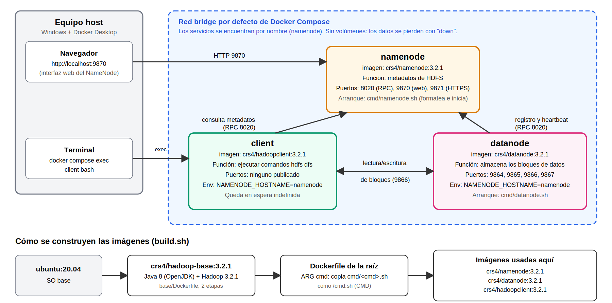

# Análisis del repositorio crs4/hadoop-docker

> Fecha de consulta de los datos de GitHub: 04/10/2026

## 1. Información general

| Dato | Valor |
|---|---|
| Nombre | hadoop-docker |
| Autor / organización | CRS4 |
| URL | https://github.com/crs4/hadoop-docker |
| Fecha de creación | 15/02/2019 |
| Última actualización | 17/12/2020 |
| Estrellas | 5 |
| Forks | 4 |
| Licencia | Apache-2.0 |
| Issues abiertos | 2 |

**Objetivo del proyecto:** ofrecer imágenes Docker de Apache Hadoop, una por cada servicio (NameNode, DataNode, ResourceManager, NodeManager, HistoryServer y cliente), más una imagen "todo en uno" que corre todos los servicios en un solo contenedor. Incluye archivos Docker Compose para levantar un cluster pequeño de pruebas.

## 2. Tecnologías

| Elemento | Detalle |
|---|---|
| Tecnología Big Data principal | Apache Hadoop (HDFS, YARN y MapReduce) |
| Versión de Hadoop | 3.2.1 (por defecto); el script de construcción permite elegir otras, como 2.9.2 |
| Docker | Sí. Imágenes propias construidas con Dockerfile |
| Docker Compose | Sí. Formato `version: "3"` |
| Sistema operativo base | Ubuntu 20.04 |
| Java | OpenJDK 8 (JRE headless, sin interfaz gráfica) |
| Bases de datos | Ninguna. Los datos viven en HDFS y los metadatos los maneja el NameNode |
| Frameworks adicionales | Ninguno |
| Lenguajes | Shell (scripts de arranque y construcción), Dockerfile, Python (`manual_build.py`) |

## 3. Archivos principales del repositorio

Los archivos `.env`, `build.sh` y `docker-compose-hdfs.yml` se copiaron a nuestro repositorio; el resto se describe del repositorio original.

| Archivo / carpeta | Para qué sirve |
|---|---|
| `docker-compose.yml` | Cluster completo: 6 servicios (HDFS + YARN + MapReduce + cliente) |
| `docker-compose-hdfs.yml` | Cluster solo HDFS: 3 servicios (el que se usa en este trabajo) |
| `.env` | Define la versión de Hadoop y los puertos que usa el compose completo |
| `Dockerfile` | Receta parametrizada: genera una imagen distinta según el argumento `cmd` |
| `Dockerfile.secdn` | Variante de DataNode "seguro" |
| `base/Dockerfile` | Construye la imagen base `crs4/hadoop-base` con Hadoop instalado |
| `cmd/*.sh` | Script de arranque de cada servicio (`namenode.sh`, `datanode.sh`, `hadoop.sh`, etc.) |
| `build.sh` | Construye la imagen base y todas las imágenes de servicio |
| `push.sh`, `manual_build.py`, `.travis.yml` | Publicación de imágenes, construcción manual e integración continua |
| `test/` | Pruebas del proyecto |

## 4. Arquitectura

El repositorio ofrece dos archivos compose. En este trabajo se desplegó `docker-compose-hdfs.yml` (3 contenedores); el compose completo (`docker-compose.yml`, 6 contenedores) se analiza solo como referencia.

### 4.1 Cluster usado en este trabajo (`docker-compose-hdfs.yml`)

Son **3 contenedores**:

| Contenedor | Imagen | Función | Puertos (host:contenedor) | Variables de entorno |
|---|---|---|---|---|
| namenode | `crs4/namenode:3.2.1` | Es el "jefe" de HDFS: guarda los metadatos (qué archivos existen y en qué bloques están) | 8020 (RPC), 9870 (web), 9871 (web HTTPS) | Ninguna |
| datanode | `crs4/datanode:3.2.1` | Guarda físicamente los bloques de datos | 9864 (web), 9865 (web HTTPS), 9866 (transferencia de datos), 9867 (IPC) | `NAMENODE_HOSTNAME=namenode` |
| client | `crs4/hadoopclient:3.2.1` | Contenedor desde el que se ejecutan los comandos `hdfs dfs ...`. Queda en espera indefinida | Ninguno | `NAMENODE_HOSTNAME=namenode` |

### 4.2 Cluster completo (`docker-compose.yml`)

Son **6 contenedores**. Los puertos y la versión vienen del archivo `.env`.

| Contenedor | Imagen | Función | Puerto (variable) | Variables de entorno |
|---|---|---|---|---|
| namenode | `crs4/namenode:${HADOOP_VERSION}` | Metadatos de HDFS | 8020 (`NN_PORT`), 9870 (`NN_HTTP_PORT`) | Ninguna |
| datanode | `crs4/datanode:${HADOOP_VERSION}` | Almacena bloques | 9866 (`DN_PORT`), 9864 (`DN_HTTP_PORT`), 9867 (`DN_IPC_PORT`) | `NAMENODE_HOSTNAME` |
| resourcemanager | `crs4/resourcemanager:${HADOOP_VERSION}` | Reparte los recursos del cluster entre las aplicaciones YARN | 8088 (`RM_PORT`) | `NAMENODE_HOSTNAME` |
| nodemanager | `crs4/nodemanager:${HADOOP_VERSION}` | Ejecuta las tareas asignadas por el ResourceManager | 8042 (`NM_PORT`) | `NAMENODE_HOSTNAME`, `RESOURCEMANAGER_HOSTNAME` |
| historyserver | `crs4/historyserver:${HADOOP_VERSION}` | Guarda el historial de trabajos MapReduce terminados | 19888 (`HS_PORT`) | `NAMENODE_HOSTNAME`, `RESOURCEMANAGER_HOSTNAME` |
| client | `crs4/hadoopclient:${HADOOP_VERSION}` | Cliente para ejecutar comandos HDFS y trabajos MapReduce | Ninguno | `NAMENODE_HOSTNAME`, `RESOURCEMANAGER_HOSTNAME` |

### 4.3 Redes

El compose **no define ninguna red**. Docker Compose crea automáticamente una red `bridge` propia del proyecto y conecta todos los contenedores a ella. Dentro de esa red cada servicio se encuentra por su nombre (`namenode`, `resourcemanager`, etc.), por eso las variables `NAMENODE_HOSTNAME=namenode` funcionan sin necesidad de direcciones IP.

### 4.4 Volúmenes

**No hay volúmenes definidos.** Los datos de HDFS se guardan dentro del sistema de archivos del contenedor. Mientras los contenedores solo se detengan, los datos siguen ahí; si se eliminan (`docker compose down`), los datos **se pierden**.

### 4.5 Dependencias entre servicios

No se usa `depends_on`. Las dependencias son lógicas, no declaradas:

- El **datanode** necesita al **namenode** para registrarse.
- El **client** necesita al **namenode** (y al **resourcemanager** en el compose completo).
- El **nodemanager** necesita al **resourcemanager** y al namenode.
- El **historyserver** necesita al namenode y al resourcemanager.

Como el orden de arranque no está garantizado, un servicio puede tardar unos segundos en conectarse hasta que el namenode esté listo.

### 4.6 Variables de entorno

| Variable | Dónde se usa | Qué hace |
|---|---|---|
| `HADOOP_VERSION` | `.env`, `build.sh`, compose completo | Versión de Hadoop (3.2.1) y etiqueta de las imágenes |
| `NN_PORT`, `NN_HTTP_PORT`, `DN_PORT`, `DN_HTTP_PORT`, `DN_IPC_PORT`, `RM_PORT`, `NM_PORT`, `HS_PORT` | `.env` | Puertos publicados en el compose completo |
| `NAMENODE_HOSTNAME` | Compose | Nombre del host donde está el NameNode |
| `RESOURCEMANAGER_HOSTNAME` | Compose | Nombre del host donde está el ResourceManager |
| `HADOOP_CUSTOM_CONF_DIR` | README del repo | Carpeta con archivos de configuración propios que reemplazan los predeterminados |
| `DEBUG` | `cmd/namenode.sh` | Si está definida, el script muestra cada comando que ejecuta |

### 4.7 Archivos de configuración

- Archivos del repositorio original: `.env`, `docker-compose.yml` y `docker-compose-hdfs.yml`. En nuestro repositorio se copiaron `.env` y `docker-compose-hdfs.yml`.
- Según el README del repositorio, la configuración de Hadoop dentro de las imágenes está en `/opt/hadoop/etc/hadoop`. Es una configuración sencilla para pruebas y se puede reemplazar con la variable `HADOOP_CUSTOM_CONF_DIR` o montando un volumen.
- Según el mismo README, el entrypoint reemplaza `localhost` en la propiedad `fs.defaultFS` por el hostname del contenedor, o por el valor de `NAMENODE_HOSTNAME` si está definida.

### 4.8 Diagrama de arquitectura

## 5. Cómo se construyen las imágenes

1. **Imagen base (`base/Dockerfile`)**: se construye en dos etapas. En la primera, a partir de `crs4/hadoop-nativelibs`, se descarga e instala Hadoop con el script `install_hadoop.sh`. En la segunda, se parte de una imagen limpia `ubuntu:20.04`, se instala Java 8 y se copia solo el Hadoop ya instalado. Así la imagen final es más liviana. Se publica como `crs4/hadoop-base:3.2.1`.
2. **Imágenes de servicio (`Dockerfile` de la raíz)**: una sola receta con un argumento `cmd`. Toma la imagen base y copia `cmd/<cmd>.sh` como `/cmd.sh`, que es lo que se ejecuta al iniciar. Cambiando `cmd` se obtienen las imágenes `namenode`, `datanode`, `resourcemanager`, `nodemanager`, `historyserver`, `hadoopclient`, `hdfs` y `hadoop`.
3. **`build.sh`**: construye primero la base, luego recorre la lista de servicios construyendo cada imagen, y al final construye la variante de DataNode seguro.

En este trabajo no se construyeron las imágenes: se usaron las ya publicadas en Docker Hub (`crs4/namenode:3.2.1`, `crs4/datanode:3.2.1` y `crs4/hadoopclient:3.2.1`).

## 6. Cómo arranca cada servicio

Ejemplo, el NameNode (`cmd/namenode.sh`):

1. Consulta en la configuración dónde se guardan los metadatos (`dfs.namenode.name.dir`).
2. Si esa carpeta aún no tiene datos (`current`), **formatea** el NameNode, es decir, lo inicializa.
3. Inicia el servicio con `hdfs namenode`, que queda corriendo en primer plano como proceso principal del contenedor.

## 7. Limitaciones y deuda técnica

- **Scripts deprecados**: `cmd/hadoop.sh` y `cmd/hdfs.sh` usan `hadoop-daemon.sh`, `yarn-daemon.sh` y `mr-jobhistory-daemon.sh`, que están obsoletos en Hadoop 3. Siguen funcionando en 3.2.x. El repo tiene un issue abierto sobre esto, porque cambiarlos exigiría lógica distinta para Hadoop 2 y Hadoop 3. Los servicios individuales usados aquí (`namenode.sh`) no dependen de esos scripts.
- **Sin persistencia**: no hay volúmenes, así que los datos se pierden al eliminar los contenedores.
- **Sin actualizaciones recientes**: el último cambio fue el 17/12/2020. Las imágenes se basan en Ubuntu 20.04 y en la versión 3.2.1 de Hadoop, ambas antiguas.
- **Sin control de arranque**: no hay `depends_on` ni healthchecks.
- **Puertos publicados**: el compose publica varios puertos al host; en un entorno real habría que limitarlos.

## 8. Resumen

`crs4/hadoop-docker` es un conjunto de imágenes de Hadoop 3.2.1 sobre Ubuntu 20.04 con Java 8, construidas con una receta parametrizada, y dos archivos Compose para levantar un cluster pequeño. Para este trabajo se usa el compose de HDFS (NameNode, DataNode y cliente), que es liviano y permite hacer la prueba funcional de crear un directorio, cargar un archivo y consultarlo.